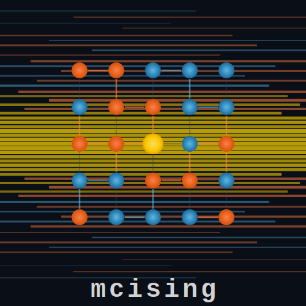

<p align="center">
  
</p>

<h1 align="center">mcising</h1>

<p align="center">
  High-performance Ising model Monte Carlo simulation with a Rust core.
</p>

<p align="center">
  <a href="https://pepy.tech/project/mcising"></a>
</p>

---

**mcising** is a Python library for Monte Carlo simulation of Ising spin systems. It supports 5 lattice geometries, J1-J2-J3 frustrated magnetism with external fields, 3 Monte Carlo algorithms, 3 execution modes (including parallel tempering), and adaptive thermalization. The performance-critical core is written in Rust via PyO3.

## Performance

**2.7-3.4x faster** than [peapods](https://github.com/PeaBrane/peapods) (Rust/PyO3) across all shared benchmarks.

MacBook Pro 14-inch (2023, Apple M2 Pro, 32 GB). Reproduce with [`benchmarks/compare_peapods.py`](benchmarks/compare_peapods.py).

```
Metropolis: Square (32×32, T=2.269)
┏━━━━━━━━━━━━━━━━━┳━━━━━━━━━┳━━━━━━━━━━━━━┳━━━━━━━━━━━━┳━━━━━━━━━┳━━━━━━━━━━━━━┓
┃ Implementation  ┃    Time ┃ Updates/sec ┃ Sweeps/sec ┃  E/site ┃  vs mcising ┃
┡━━━━━━━━━━━━━━━━━╇━━━━━━━━━╇━━━━━━━━━━━━━╇━━━━━━━━━━━━╇━━━━━━━━━╇━━━━━━━━━━━━━┩
│ mcising         │ 0.038 s │ 269,221,877 │    262,912 │ -1.3906 │        1.0x │
│ peapods         │ 0.131 s │  78,146,389 │     76,315 │ -1.4250 │ 3.4x slower │
└─────────────────┴─────────┴─────────────┴────────────┴─────────┴─────────────┘

Metropolis: Triangular (32×32, T=3.641)
┏━━━━━━━━━━━━━━━━━┳━━━━━━━━━┳━━━━━━━━━━━━━┳━━━━━━━━━━━━┳━━━━━━━━━┳━━━━━━━━━━━━━┓
┃ Implementation  ┃    Time ┃ Updates/sec ┃ Sweeps/sec ┃  E/site ┃  vs mcising ┃
┡━━━━━━━━━━━━━━━━━╇━━━━━━━━━╇━━━━━━━━━━━━━╇━━━━━━━━━━━━╇━━━━━━━━━╇━━━━━━━━━━━━━┩
│ mcising         │ 0.046 s │ 223,340,013 │    218,105 │ -2.1836 │        1.0x │
│ peapods         │ 0.157 s │  65,100,107 │     63,574 │ -2.0238 │ 3.4x slower │
└─────────────────┴─────────┴─────────────┴────────────┴─────────┴─────────────┘

Metropolis: Cubic (16³, T=4.5115)
┏━━━━━━━━━━━━━━━━━┳━━━━━━━━━┳━━━━━━━━━━━━━┳━━━━━━━━━━━━┳━━━━━━━━━┳━━━━━━━━━━━━━┓
┃ Implementation  ┃    Time ┃ Updates/sec ┃ Sweeps/sec ┃  E/site ┃  vs mcising ┃
┡━━━━━━━━━━━━━━━━━╇━━━━━━━━━╇━━━━━━━━━━━━━╇━━━━━━━━━━━━╇━━━━━━━━━╇━━━━━━━━━━━━━┩
│ mcising         │ 0.279 s │ 146,924,310 │     35,870 │ -1.1982 │        1.0x │
│ peapods         │ 0.812 s │  50,430,683 │     12,312 │ -1.0385 │ 2.9x slower │
└─────────────────┴─────────┴─────────────┴────────────┴─────────┴─────────────┘

Wolff: Square (32×32, T=2.269)
┏━━━━━━━━━━━━━━━━━┳━━━━━━━━━┳━━━━━━━━━━━━━┳━━━━━━━━━━━━┳━━━━━━━━━┳━━━━━━━━━━━━━┓
┃ Implementation  ┃    Time ┃ Updates/sec ┃ Sweeps/sec ┃  E/site ┃  vs mcising ┃
┡━━━━━━━━━━━━━━━━━╇━━━━━━━━━╇━━━━━━━━━━━━━╇━━━━━━━━━━━━╇━━━━━━━━━╇━━━━━━━━━━━━━┩
│ mcising (wolff) │ 0.103 s │  99,690,738 │     97,354 │ -1.5117 │        1.0x │
│ peapods         │ 0.337 s │  30,386,647 │     29,674 │ -1.4337 │ 3.3x slower │
└─────────────────┴─────────┴─────────────┴────────────┴─────────┴─────────────┘

Swendsen-Wang: Square (32×32, T=2.269)
┏━━━━━━━━━━━━━━━━━┳━━━━━━━━━┳━━━━━━━━━━━━━┳━━━━━━━━━━━━┳━━━━━━━━━┳━━━━━━━━━━━━━┓
┃ Implementation  ┃    Time ┃ Updates/sec ┃ Sweeps/sec ┃  E/site ┃  vs mcising ┃
┡━━━━━━━━━━━━━━━━━╇━━━━━━━━━╇━━━━━━━━━━━━━╇━━━━━━━━━━━━╇━━━━━━━━━╇━━━━━━━━━━━━━┩
│ mcising         │ 0.214 s │  47,960,246 │     46,836 │ -1.3125 │        1.0x │
│ peapods         │ 0.569 s │  18,008,160 │     17,586 │ -1.4323 │ 2.7x slower │
└─────────────────┴─────────┴─────────────┴────────────┴─────────┴─────────────┘
```

mcising also supports features not available in peapods: J2/J3 coupling, external magnetic field, honeycomb lattice, 1D chain, and parallel tempering.

## Features

- **5 lattice geometries** -- square, triangular, honeycomb (2-sublattice), cubic (3D), chain (1D)
- **3 MC algorithms** -- Metropolis, Wolff cluster, Swendsen-Wang cluster
- **3 execution modes** -- sequential cool-down, independent parallel (Rayon), parallel tempering with replica exchange
- **J1-J2-J3 frustrated magnetism** -- nearest, next-nearest, and third-nearest-neighbor couplings
- **External magnetic field** -- h coupling, compatible with all lattices
- **15 Metropolis strategies** -- auto-selected lookup tables optimized per coupling combination
- **Adaptive thermalization** -- MSER equilibration detection + Sokal autocorrelation estimation
- **Correlation functions** -- spin-spin correlation and correlation length
- **HDF5 output** with crash-safe incremental checkpointing
- **Rich CLI** with progress bars, benchmarking, and structured output
- **Fully reproducible** -- deterministic RNG (Xoshiro256**), same seed = same results

## Installation

```bash
pip install mcising
```

For development (requires Rust toolchain):

```bash
git clone https://github.com/bcivitcioglu/mcising.git
cd mcising
uv sync
uv run maturin develop
```

## Quick Start

### Python API

```python
from mcising import Simulation, SimulationConfig, LatticeConfig, LatticeType

config = SimulationConfig(
    lattice=LatticeConfig(size=32, j1=1.0),
    temperatures=(3.0, 2.269, 1.5),
    n_sweeps=1000,
    seed=42,
)

sim = Simulation(config)
results = sim.run()

# Access results per temperature
for T in results.temperatures:
    print(f"T={T:.3f}: <E>={results.energy[T].mean():.4f}, "
          f"<|M|>={abs(results.magnetization[T]).mean():.4f}")
```

### Multiple Lattice Types

```python
from mcising import LatticeType

# Triangular lattice with J1-J2 frustration
config = SimulationConfig(
    lattice=LatticeConfig(
        lattice_type=LatticeType.TRIANGULAR,
        size=32,
        j1=1.0,
        j2=0.5,
    ),
    temperatures=(4.0, 3.641, 2.0),
    n_sweeps=1000,
)

# Also available: HONEYCOMB, CUBIC, CHAIN
```

### Parallel Execution

```python
from mcising import ExecutionMode

# Independent: each temperature runs in parallel (uses all CPU cores)
config = SimulationConfig(
    lattice=LatticeConfig(size=32),
    temperatures=(3.0, 2.5, 2.269, 2.0, 1.5),
    n_sweeps=1000,
    mode=ExecutionMode.INDEPENDENT,  # ~6x faster with 10 cores
)

# Parallel Tempering: parallel + replica swap for better sampling
config = SimulationConfig(
    lattice=LatticeConfig(size=32),
    temperatures=(3.0, 2.5, 2.269, 2.0, 1.5),
    n_sweeps=1000,
    mode=ExecutionMode.PARALLEL_TEMPERING,
)
```

### Adaptive Mode

For large lattices near the critical temperature, enable adaptive measurement to automatically determine thermalization length and measurement spacing:

```python
from mcising import AdaptiveConfig

config = SimulationConfig(
    lattice=LatticeConfig(size=64),
    temperatures=(3.0, 2.269, 1.5),
    adaptive=AdaptiveConfig(enabled=True, min_independent_samples=200),
    seed=42,
)

results = Simulation(config).run()

# Inspect diagnostics
for T in results.temperatures:
    diag = results.adaptive_diagnostics[T]
    print(f"T={T:.3f}: tau_int={diag.tau_int:.1f}, "
          f"interval={diag.measurement_interval}")
```

### CLI

```bash
# Basic run
mcising run -L 32 --seed 42 -o results.h5

# Triangular lattice with parallel tempering
mcising run -L 32 --lattice triangular --mode parallel_tempering

# Independent parallel execution (uses all CPU cores)
mcising run -L 32 --mode independent -T 3.0 -T 2.269 -T 1.5

# Adaptive mode
mcising run -L 64 --adaptive --min-samples 200 --seed 42

# With checkpointing (crash-safe)
mcising run -L 32 --checkpoint sim.h5

# Resume interrupted run
mcising run -L 32 --checkpoint sim.h5 --resume

# Benchmark performance across all lattices and algorithms
mcising benchmark

# Show info
mcising info
```

### Saving Results

```python
from mcising import save_hdf5, load_hdf5, save_json_summary

# HDF5 (full data)
save_hdf5(results, "results.h5")
loaded = load_hdf5("results.h5")

# JSON summary (statistics only)
save_json_summary(results, "summary.json")
```

## Architecture

```
mcising/
├── rust/src/              # Rust core (compiled to mcising._core)
│   ├── algorithm/         # MC algorithms (Metropolis, Wolff, Swendsen-Wang)
│   ├── autocorrelation.rs # MSER + Sokal windowing
│   ├── lattice/           # Lattice geometries (square, triangular, honeycomb, cubic, chain)
│   ├── observables.rs     # Energy, magnetization, correlation
│   ├── parallel.rs        # Rayon-parallelized execution (independent + parallel tempering)
│   └── simulation.rs      # PyO3 boundary (IsingSimulation)
├── python/mcising/        # Python package
│   ├── simulation.py      # High-level Simulation class
│   ├── config.py          # Frozen dataclass configs
│   ├── io.py              # HDF5/JSON I/O
│   ├── plotting.py        # Matplotlib visualization
│   └── cli.py             # Typer CLI
├── tests/                 # 401 tests (141 Rust + 260 Python)
└── benchmarks/            # Reproducible performance comparisons
```

## License

This project is licensed under the MIT License.
