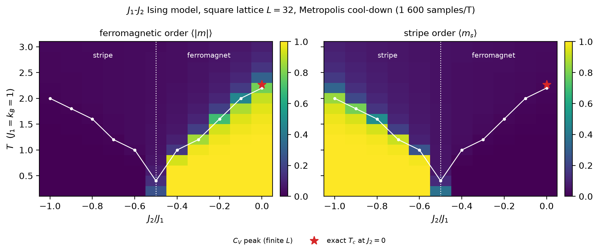

<p align="center">
  
</p>

<h1 align="center">mcising</h1>

<p align="center">
  <em>High-performance Ising model Monte Carlo simulation with a Rust core.</em>
</p>

<p align="center">
  <a href="https://github.com/bcivitcioglu/mcising/actions/workflows/ci.yml"></a>
  <a href="https://github.com/bcivitcioglu/mcising/actions/workflows/slow.yml"></a>
  <a href="https://github.com/bcivitcioglu/mcising/actions/workflows/docs.yml"></a>
  <a href="https://codecov.io/gh/bcivitcioglu/mcising"></a>
  <a href="https://pypi.org/project/mcising/"></a>
  <a href="https://pypi.org/project/mcising/"></a>
  <a href="https://pepy.tech/project/mcising"></a>
  <a href="https://github.com/bcivitcioglu/mcising/blob/master/LICENSE"></a>
</p>

---

## Why mcising

**Who it is for.** Researchers in computational and statistical physics who need classical Ising Monte Carlo they can trust and cite: studies of frustrated magnetism (competing J1-J2-J3 couplings on square, triangular, honeycomb and cubic lattices), critical phenomena and finite-size scaling, and machine-learning-for-physics work that needs large, labelled, reproducible sets of spin configurations.

**The gap it fills.** Textbook Ising codes are easy to write and hard to get right: the sign of a coupling, the neighbour table of a non-square lattice, the error bar on a specific heat. mcising packages the parts that go wrong as tested, pip-installable infrastructure — a Rust core checked against exact enumeration of small systems and against exact results (Onsager's solution, the critical temperatures of four lattices) on large ones; blocking and jackknife errors on every observable, with integrated autocorrelation times and adaptive thermalization; three execution modes including parallel tempering; and HDF5 output that records the configuration, seed, version and commit needed to reproduce a run. Antiferromagnetic and competing couplings, the case most reduced examples get wrong, go through the same tests as the ferromagnet.

**Research context.** mcising was developed alongside and used in a study of phase determination in the frustrated J1-J2 Ising model with deep learning (Çivitcioğlu, Römer & Honecker, [Phys. Rev. E 111, 024131 (2025)](https://doi.org/10.1103/PhysRevE.111.024131), [arXiv:2403.09786](https://arxiv.org/abs/2403.09786)) and its follow-up on minimal training sets ([arXiv:2504.19795](https://arxiv.org/abs/2504.19795)). The [frustration tutorial](tutorial/frustrated-magnetism.md) reproduces the stripe phase of that model, and the [examples](https://github.com/bcivitcioglu/mcising/tree/master/examples) reproduce Onsager's exact solution and a Binder-cumulant determination of Tc:



How mcising compares with peapods, ALPS and the Julia spin-model packages, feature by feature, is on the [related work](advanced/related-work.md) page.

## Install

=== "uv"

    ```bash
    uv add mcising
    ```

=== "pip"

    ```bash
    pip install mcising
    ```

## Quick example

```python
from mcising import Simulation, SimulationConfig, LatticeConfig

# Configure: 32x32 square lattice, three temperatures across Tc
config = SimulationConfig(
    lattice=LatticeConfig(size=32, j1=1.0),
    temperatures=(3.0, 2.269, 1.5),
    n_sweeps=1000,
    seed=42,
)

# Run
results = Simulation(config).run()

# Inspect
for T in results.temperatures:
    E = results.energy[T].mean()
    M = abs(results.magnetization[T]).mean()
    print(f"T={T:.3f}: <E>={E:.4f}, <|M|>={M:.4f}")
```

This runs a Monte Carlo simulation of the 2D Ising model on a 32x32 square lattice, scanning through three temperatures including the critical point Tc = 2.269.

---

## What mcising gives you

<div class="grid cards" markdown>

-   :material-grid:{ .lg .middle } **5 Lattice Geometries**

    ---

    Square, triangular, honeycomb, cubic (3D), and chain (1D). All with periodic boundary conditions.

    [:octicons-arrow-right-24: Lattice types](tutorial/lattice-types.md)

-   :material-lightning-bolt:{ .lg .middle } **Rust-core throughput**

    ---

    <!-- benchmarks:index-card:begin -->
    351M Metropolis spin updates per second on one core (32×32 at Tc, Apple M4) — 140.4× faster than pure Python, 15.0× faster than a NumPy checkerboard.
    <!-- benchmarks:index-card:end -->

    [:octicons-arrow-right-24: Performance](advanced/performance.md)

-   :material-atom:{ .lg .middle } **J1-J2-J3 Frustrated Magnetism**

    ---

    Nearest, next-nearest, and third-nearest-neighbor couplings plus external field. 15 auto-optimized Metropolis strategies.

    [:octicons-arrow-right-24: Frustrated magnetism](tutorial/frustrated-magnetism.md)

-   :material-server-network:{ .lg .middle } **3 Execution Modes**

    ---

    Sequential cool-down, independent parallel (Rayon), or parallel tempering with replica exchange.

    [:octicons-arrow-right-24: Parallel execution](tutorial/parallel-execution.md)

-   :material-chart-scatter-plot:{ .lg .middle } **3 MC Algorithms**

    ---

    Metropolis single-spin-flip, Wolff cluster, and Swendsen-Wang cluster. Choose the right tool for your physics.

    [:octicons-arrow-right-24: Algorithms](tutorial/cluster-algorithms.md)

-   :material-auto-fix:{ .lg .middle } **Adaptive Thermalization**

    ---

    MSER equilibration detection + Sokal autocorrelation estimation. No more guessing warmup sweeps.

    [:octicons-arrow-right-24: Adaptive mode](tutorial/adaptive-mode.md)

</div>

## Or use the CLI

```bash
mcising run -L 32 -T 3.0 -T 2.269 -T 1.5 -o results.h5
mcising summary results.h5
mcising plot energy results.h5 -o energy.png
mcising plot specific-heat results.h5 -o cv.png
mcising export results.h5 lattices.zip
```

Full CLI reference: **[CLI Guide](guide/cli.md)**

## Citing

If mcising contributes to published work, please cite it. The repository's [`CITATION.cff`](https://github.com/bcivitcioglu/mcising/blob/master/CITATION.cff) carries the current version and is what GitHub's "Cite this repository" button renders; a Zenodo DOI is attached at v1.0.0.

```bibtex
@software{mcising,
  author  = {{\c{C}}ivitcio{\u{g}}lu, Burak},
  title   = {mcising: high-performance {Ising} model {Monte Carlo} simulation with a {Rust} core},
  url     = {https://github.com/bcivitcioglu/mcising},
  license = {MIT},
  note    = {Version as installed; see \texttt{mcising.\_\_version\_\_}},
}
```

If the J1-J2 functionality supported your research, consider also citing the study it was developed for: Çivitcioğlu, Römer & Honecker, *Phase determination with and without deep learning*, Phys. Rev. E 111, 024131 (2025).

## Next steps

New to mcising? Start with the **[Tutorial](tutorial/first-simulation.md)** — it walks you through a complete simulation in 5 minutes.

Looking for a specific function or class? Check the **[API Reference](reference/simulation.md)**.

Need CLI commands? See the **[CLI Reference](guide/cli.md)**.

Building on top of mcising? Read **[Stability & Versioning](advanced/stability.md)** for what the API promises.
