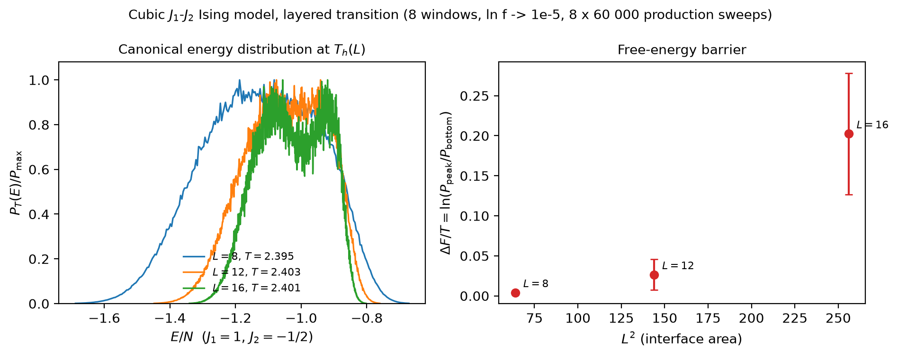

# Wang-Landau Sampling

Parallel tempering stops working at a strongly first-order transition. The
two coexisting phases are separated by a free-energy barrier that grows
with the interface area, replicas stay trapped on one side, and the ladder
returns smooth averages that are simply wrong — `results.pt_diagnostics`
shows it as a round-trip count of zero. A flat-histogram method walks
*through* the barrier instead: it samples every energy equally often, so
the interface configurations between the phases are visited as readily as
the phases themselves.

mcising implements this as two stages behind one call:

1. **Wang-Landau** estimates the density of states $g(E)$ on the exact
   energy grid of the couplings.
2. A **multicanonical production run** freezes the weights $W(E) = 1/g(E)$
   and records the energy, magnetization and staggered magnetizations of
   independent walkers whose energy histogram is flat.

Canonical averages at *any* temperature then follow by reweighting the
production series, with error bars and mixing diagnostics. The physics is
laid out on the [physics page](../advanced/physics.md#wang-landau-and-multicanonical-sampling).

## Estimating the density of states

```python
from mcising import LatticeConfig, WangLandauConfig, WangLandauSimulation

config = WangLandauConfig(
    lattice=LatticeConfig(size=8, j1=1.0),
    log_f_final=1e-4,       # tutorial budget; the default 1e-6 is a few seconds here
    production_sweeps=5_000,
    n_walkers=2,
)
results = WangLandauSimulation(config).run(show_progress=False)

wl = results.wang_landau
print(wl.converged, wl.n_iterations, wl.visited_bins)
print(results.energy_bins[:3], results.log_g[:3])
```

`results.log_g` is $\ln g(E)$ per energy bin, up to an additive constant,
with `nan` where no state exists (on the square lattice the energy one step
above the ground state is empty) or the walker never went. The bins are
exact: every single-spin flip changes the energy by a multiple of the bin
width, so no reachable energy falls between two bins.

The modification factor starts at $\ln f = 1$, halves each time the
visit histogram is flat (`flatness=0.8`: its minimum reaches 80 % of its
mean), and once it drops below $1/t$ it follows the $1/t$ schedule of
Belardinelli and Pereyra, which removes the saturation error of the plain
algorithm. `log_f_final` is therefore a cost knob rather than an accuracy
knob: the production stage that follows would give unbiased averages even
with crude weights, and the weights only decide how flat its histogram is.

## Reweighting to any temperature

```python
for estimate in results.reweight_curve((2.0, 2.269, 3.0)):
    print(
        f"T={estimate.temperature}: E/N = {estimate.energy}, "
        f"Cv/N = {estimate.specific_heat}, n_eff = {estimate.effective_samples:.0f}"
    )
```

Every sample of the production run carries the canonical weight
$w_i = g(E_i)\, e^{-\beta E_i}$, and $\langle A \rangle_T = \sum_i w_i A_i
/ \sum_i w_i$. The errors are delete-one-block jackknife errors whose
blocks never straddle two walkers (from eight walkers on, every walker is
one block). Compare the printed values with the exact finite-lattice
solution of the $8 \times 8$ torus to see the agreement; the
[test suite](https://github.com/bcivitcioglu/mcising/blob/master/tests/test_wang_landau.py)
does exactly that.

`reweight` also returns the energy cumulant $V = 1 - \langle e^4 \rangle /
(3 \langle e^2 \rangle^2)$, the uniform magnetization with its
susceptibility and Binder cumulant, and the same three quantities for an
**order parameter** $\psi = \max_k |m_k|$ over staggered-magnetization
components — the stripe (`1, 2` on the square lattice) or layered (`1, 2,
4` on the cubic lattice) order that the uniform magnetization cannot see:

```python
estimate = results.reweight(2.269, order_parameter=(3,))   # Néel component
print(estimate.order_parameter, estimate.order_binder)
```

`to_dataframe(temperatures)` gives the same numbers as a pandas table.

## Reading the diagnostics

A flat-histogram run that did not connect the two ends of its energy range
is as misleading as a parallel-tempering ladder that never swapped, so the
evidence is recorded:

```python
prod = results.production
print(prod.round_trips)              # excursions lowest bin → highest bin → lowest, per walker
print(round(prod.histogram_flatness, 2))   # min H / mean H of the production histogram
print(round(results.reweight(2.269).edge_weight, 3))
```

- `wang_landau.converged` is `False` when `max_wl_sweeps` cut the first
  stage short; the weights are then only as good as
  `histogram_flatness` says.
- `round_trips` is the direct mixing evidence: a walker with none has not
  demonstrably crossed its window.
- `effective_samples` is the Kish effective sample size of the reweighting
  at the requested temperature; a small value means the run barely
  covers that temperature.
- `edge_weight` is the canonical weight in the bins where an energy
  window cuts the spectrum. It must be tiny, or the window is cutting
  into the distribution you are asking about (a run over the whole
  spectrum reports zero).

`results.summary((2.0, 2.269))` prints all of this in one go and says
loudly when the first stage did not converge.

## Energy windows

At large sizes the whole spectrum is far more than you need: a
first-order transition lives in the energy range that covers both
coexisting phases. `energy_window=(lo, hi)` restricts the walk to that
per-site range (the walker is driven into it with a few Metropolis sweeps
first), which cuts the cost by orders of magnitude. Take the range from a
short canonical pilot on either side of the transition, with a margin of
several standard deviations of the energy, and check `edge_weight`
afterwards.

## Free-energy barriers

The cubic $J_1$-$J_2$ model with $J_2 = -J_1/2$ orders into layered
antiferromagnetic planes through a first-order transition. Its canonical
energy histogram is bimodal at the transition once the lattice is large
enough for the two peaks to separate (from about $L = 12$); the barrier
between them grows with the interface area, and the temperature at which
the peaks are equally high is the finite-size transition temperature.

```python
from mcising import LatticeType

config = WangLandauConfig(
    lattice=LatticeConfig(lattice_type=LatticeType.CUBIC, size=4, j1=1.0, j2=-0.5),
    energy_window=(-1.7, -0.5),
    log_f_final=1e-3,
    production_sweeps=2_000,
    n_walkers=2,
)
cubic = WangLandauSimulation(config).run(show_progress=False)

energies, probability = cubic.canonical_energy_histogram(2.4)
barrier = cubic.free_energy_barrier(2.4)
print(barrier.barrier, barrier.energy_low, barrier.energy_high)
print(cubic.equal_height_temperature((2.2, 2.6)))
print(cubic.equal_weight_temperature((2.2, 2.6), q=6.0))
```

At $L = 4$ the histogram has a single broad peak, so the barrier and the
pseudo-transition temperatures come back as `nan` — the honest answer. At
$L = 16$ and beyond, `free_energy_barrier(T)` returns $\Delta F / T =
\ln(P_\mathrm{peak} / P_\mathrm{bottom})$ (Lee and Kosterlitz), where the
bottom is the mean over the middle third between the peaks — the slab
plateau of a periodic box — together with the interface tension $\sigma =
T\,(\Delta F/T) / (2 L^{d-1})$. `equal_height_temperature` and
`equal_weight_temperature` bracket the two finite-size estimates of the
transition temperature; the equal-weight one with `q` equal to the number
of ordered states (six for the layered phase: three axes, two signs) has
the smallest finite-size corrections.

The committed script
[`examples/cubic_first_order.py`](https://github.com/bcivitcioglu/mcising/blob/master/examples/cubic_first_order.py)
runs this analysis for $L = 8, 12, 16$ with the parallel first stage
described below and produces this figure: the reweighted energy
distributions at $T_h(L)$, single-peaked at $L = 8$ and bimodal from
$L = 12$ on, and the barrier against the interface area $L^2$.



## Scaling out

The first stage is a single random walk by default. On a large lattice
it is the expensive part (its cost grows with the number of energy bins
times `1 / log_f_final`), and it parallelises the way Vogel, Li, Wüst
and Landau's replica-exchange Wang-Landau does: the energy range is split
into `n_windows` overlapping windows, each sampled by
`walkers_per_window` walkers in parallel; adjacent windows exchange
configurations every `exchange_interval` sweeps so no walker is trapped
at a window edge; the walkers of a window pool their estimates at every
flatness check; and the windows are joined at the end where their slopes
agree. Everything else — the `1/t` schedule, the production stage, the
reweighting — is unchanged, and the run stays deterministic for any
thread count.

```python
config = WangLandauConfig(
    lattice=LatticeConfig(size=8, j1=1.0),
    n_windows=2,
    walkers_per_window=2,
    exchange_interval=20,
    check_interval=100,     # a multiple of exchange_interval
    log_f_final=1e-4,
    production_sweeps=5_000,
    n_walkers=4,
)
parallel = WangLandauSimulation(config).run(show_progress=False)
wl = parallel.wang_landau
print(wl.window_bins, wl.exchange_acceptance, wl.merge_bins)
print(parallel.reweight(2.269).energy)
```

`window_bins` are the bin ranges of the windows, `exchange_acceptance`
the replica-exchange acceptance per adjacent pair (a pair that never
swaps means the overlap is too small for the barrier between the
windows), and `merge_bins` the bins at which the pieces were joined. The
first stage ends when the slowest window is flat, so the wall time falls
with the number of windows until one window's own flatness sets the
pace; the block below is the speed-up `benchmarks/run_all.py` measured
on the development machine. Keep the window that matters for a
first-order transition inside one window, or at least away from a join.

<!-- benchmarks:wang_landau:begin -->
| Workload | Bins | Walkers | Sweeps per walker | Wang-Landau stage | Flip attempts/s | Wall-time speed-up | Production attempts/s |
|---|---|---|---|---|---|---|---|
| Square 32×32, whole spectrum | 1,025 | 1 | 2,141,200 | 40.27 s | 54,451,864 |  | 6,027,962 |
| Cubic 12³ J1-J2, energy window | 10,369 | 1 | 468,000 | 15.19 s | 53,247,849 | 1.0× | 10,483,343 |
| Cubic 12³ J1-J2, energy window, replica exchange | 10,369 | 8 | 218,200 | 14.26 s | 211,525,333 | 1.1× | 9,213,939 |

Wang-Landau stage to `ln f = 1e-6` (flatness checks every 200 sweeps), then a one-walker production stage of 20,000 sweeps on the frozen weights; the cubic workloads sample the J1-J2 model at J2 = -1/2 inside the per-site energy window (-1.7, -0.5) that holds both phases of its first-order transition, and the replica-exchange row runs 8 windows × 1 walkers on the Rayon pool (10 threads); Apple M4 (10 cores: 4 performance + 6 efficiency); medians of 3 runs. The replica-exchange row reaches that `ln f` in 2.1× fewer sweeps per walker than the serial cubic run; its walkers synchronise at every exchange, so the slowest of them sets the pace and the attempt rate per walker is 50% of the serial one here, which is what separates the two speed-ups.
<!-- benchmarks:wang_landau:end -->

## Saving and the command line

`save_hdf5` writes a Wang-Landau results file (its own layout and
schema, see [Saving results](../guide/saving-results.md#wang-landau-runs)),
`load_wang_landau_hdf5` reads it back with every estimate recomputed from
the stored series, and `save_json_summary(results, path,
temperatures=...)` writes the diagnostics plus the reweighted estimates.
The same run from the shell:

```bash
mcising wang-landau -L 4 --log-f-final 1e-3 --check-interval 100 --production-sweeps 200 -T 2.0 -T 3.0 -o dos.h5
mcising summary dos.h5 -T 2.269
```

## When to use which

| Situation | Tool |
|---|---|
| Continuous transition, ferromagnet | Cluster algorithms (Wolff, Swendsen-Wang) |
| Frustrated couplings, rugged landscape, weak barriers | Parallel tempering |
| First-order transition, barrier growing with size | Wang-Landau + multicanonical production |
| Thermodynamics at many temperatures from one run | Wang-Landau + reweighting |

The flat-histogram run costs about `n_bins / log_f_final` flip attempts
for its first stage plus the production sweeps, and its production
walkers run in parallel. Reuse the weights across runs: pass
`results.log_g` (or the production-refined
`results.log_density_of_states()`) as `initial_log_g` to `run()`, with
`max_wl_sweeps=0` to freeze them.
